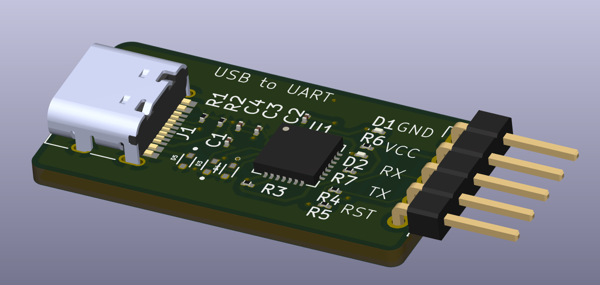

# USB to UART Converter (CP2102 Based)

This is a USB to UART converter board based on the **CP2102N** chip, allowing serial communication between a USB Type-C port and a UART interface.

---

## 🔧 Features

- USB Type-C input
- CP2102N UART bridge chip
- TX/RX LED indicators
- ESD protection on D+/D-
- 5-pin UART header output

---

## 📸 Previews

### Schematic

### 3D View

### PCB Layout

---

## 📚 Tools Used

- KiCad 9.0

---

## 🔩 Components

| Component     | Value              |
|---------------|--------------------|
| USB Port      | USB-C Receptacle   |
| Main IC       | CP2102N            |
| TVS Diodes    | LESD5D5.0CT1G      |
| Resistors     | 5.1kΩ, 10kΩ, 470Ω  |
| Capacitors    | 100nF              |
| Indicator LEDs| TX, RX             |

This project is open-source under the **MIT License**.
